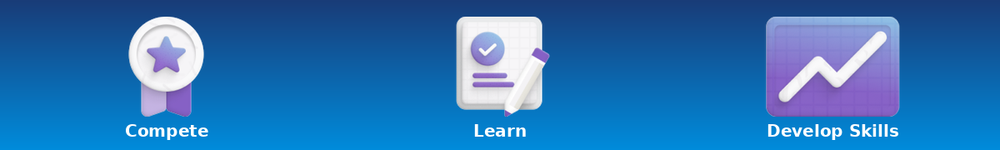
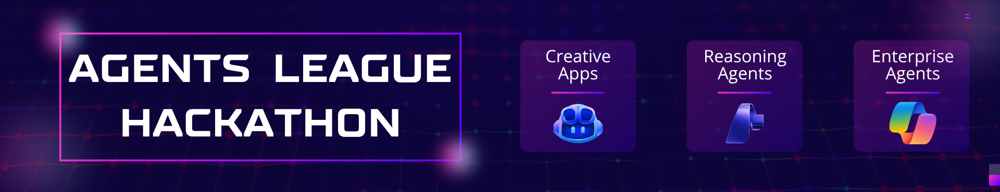
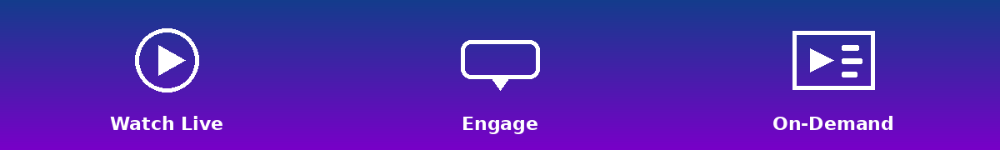

## Put your skills to the test: Join a Microsoft Build Skills Challenge

You've joined the sessions, seen the demos, and gone hands-on with the labs. Now try your new knowledge with Azure-focused skilling challenges and resources to continue your Microsoft Build 2026 journey.

| Challenge Name | Link | What You'll Do |
|----------------|------|-------|
| Azure Migration | [**Azure Migration Build Skills Challenge**](https://aka.ms/Azure_Migration/BuildSkillsChallenge) | Build the skills to migrate and modernize workloads on Azure. In this challenge, you'll learn how to use Azure Copilot, deploy and manage virtual machines, and migrate Windows, Linux, SQL Server, and VMware workloads. Gain practical experience in planning, deployment, security, and monitoring—so you can confidently move to Azure and optimize your infrastructure with AI-powered capabilities.  |
| Azure Modernization | [**Azure Modernization Build Skills Challenge**](https://aka.ms/Azure_Modernization/BuildSkillsChallenge) | Build the skills to modernize applications and accelerate innovation on Azure. In this challenge, you'll learn how to use GitHub Copilot and Azure services to refactor, rebuild, and deploy modern apps across cloud environments. Gain hands-on experience with app modernization, Java on Azure, and AI-assisted development—so you can deliver scalable, cloud-native solutions faster.  |
| SQL AI Solutions | [**SQL AI Solutions Build Skills Challenge**](https://aka.ms/SQL_AI_Solutions/BuildSkillsChallenge) | Prepare for the future of data with skills that blend SQL and AI. This skilling plan covers advanced SQL, query optimization, AI and LLM-integrated application development with SQL, and security and governance best practices. These resources help you get ready for the DP-800 SQL AI Database Developer certification exam.  |
| Fabric IQ | [**Fabric Build Skills Challenge**](https://aka.ms/Fabric/BuildSkillsChallenge) | Microsoft Fabric IQ provides a way to define business vocabulary in an ontology and bind the ontology to data sources. Learn about ontology items, data agents, Graph in Microsoft Fabric, and Power BI semantic models. Discover how ontology modeling differs from traditional analytical modeling by starting with business concepts rather than specific use cases. |

---

## Code, Collaborate and Compete - Agents League Hackathon

Ready for your next challenge? Put what you learn at Microsoft Build into action and compete for prizes at Agents League hackathon. Create and submit an AI agent to climb the leaderboard and compete for a total of $55,000 USD in prizes at this esports-inspired hackathon.

**Challenge tracks—pick one or compete in all three:**
- 🎨 Creative Apps: Build innovative applications with AI-assisted development using GitHub Copilot.
- 🧠 Reasoning Agents: Create intelligent agents using Microsoft Foundry that solve complex problems through multi-step reasoning.
- 💼 Enterprise Agents: Build business-ready agents for Microsoft 365 Copilot.

**To help create your agent, you'll have access to:**
- Live coding battles.
- Curated technical experiences and on-demand content.
- Resources on Microsoft Learn and AI Skills Navigator.

**Get Started:**
- Complete your registration by June 12, 2026, 12:00 PM Pacific Time.
- Review [Agents League hackathon rules and regulations](https://aka.ms/AgentsLeagueRules) for prize categories and judging criteria.
- Join a live coding battle, [click here for the full schedule](https://aka.ms/AISF/AL-Battles/Series).
- Get started here: [Get started with Agents League hackathon](https://aka.ms/AgentsLeague/AISF)

**Submit Your Project:**
Submit your project by June 14, 2026, 11:59 PM Pacific Time.

---

## Livestreams - Connect with our Skilling Experts

| Title | Date | Time | Synopsis | Learn More |
|------|------|---------------|----------|------------|
| Agents League-Creative Apps Battle | June 9th | 9:00-10:00 am Pacific | Experts use AI-assisted development to create innovative apps. They'll demonstrate GitHub Copilot and inspire participants to apply this knowledge in their submissions. | [**🎨Creative Apps Battle**](https://aka.ms/AISF/AL-Battle1/Reg) |
| Agents League-Reasoning Agents Battle | June 10th | 9:00 am-10:00 am Pacific | Experts use multi-step reasoning to create intelligent agents that solve complex problems. They'll demonstrate how to build with Microsoft Foundry and inspire participants to apply learnings in their submissions. | [**🧠Reasoning Agents Battle**](https://aka.ms/AISF/AL-Battle3/Reg) |
| Agents League-Enterprise Agents Battle | June 11th | 9:00 am-10:00 am Pacific | Experts build business‑ready knowledge agents integrated with Microsoft 365, authored in Copilot Studio. The hosts will send off the audience onto their last sprint before the hackathon closes on June 14th. | [**💼Enterprise Agents Battle**](https://aka.ms/AISF/AL-Battle5/Reg) |
| Azure Decoded: Ship & Monetize Agents-Architecture, Readiness, Release | June 10th | 12:00 pm-1:00 pm Pacific | Your agent works. Now make it shippable — and sellable. Learn what it truly takes to go from prototype to Microsoft Marketplace, with a no-nonsense walkthrough of production readiness, publishing workflow, and the checklists you need to turn what you've built into a commercial product. | [**🏪Ship & Monetize on Marketplace**](https://aka.ms/AgentsLeagueMarketplaceReactor) |
| Build awareness of AI app & agent development on Foundry with Claude Models | June 17th | 12:00 pm-1:00 pm Pacific | Learn to build intelligent AI apps using Microsoft Foundry and Claude — covering model deployment, prompt design, context management, and tool invocation. Explore agentic workflows, real-world use cases (copilots, automation, agents), and build working app components. Ideal for developers and solution architects. | [**✳️MSFT Foundry with Claude**](https://aka.ms/AI_App_Agent_onFoundry_withClaude) |
