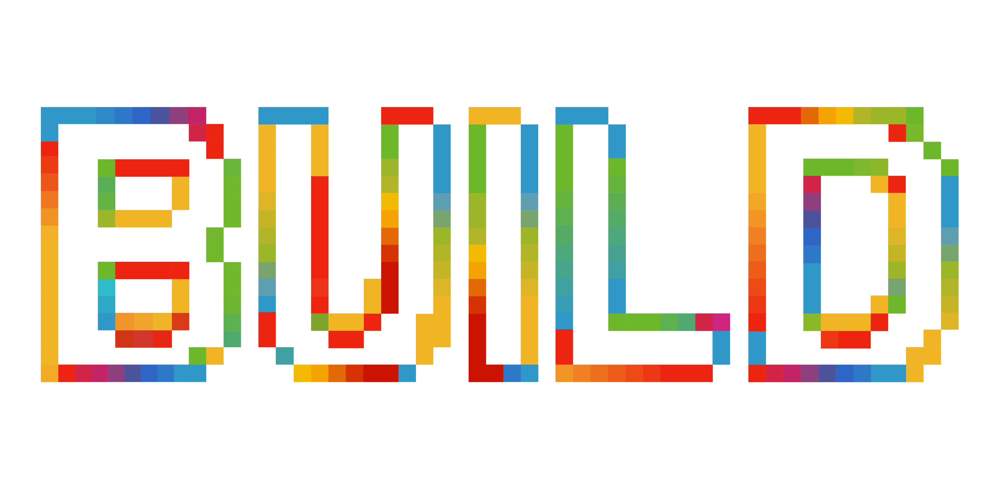

# Microsoft Build 2026 — Next Steps

Microsoft Build is anchored in technical depth, developer credibility, and interactive creation. Engage with session-specific content in your environment with interactive repos to further your learning for your own purposes. Click on a topic to see the repos for each session.

## Session Topics

Explore lab and session repositories organized by topic to engage in interactive activities to further your learning from Microsoft Build. Click on each topic area to see the list of sessions and their associated repos to start.

| Topic | Description |
| --- | --- |
| [Agents & Apps](agents-apps.md) | Focuses on building applications and agents from a single prompt to agent framework for developers who are building for task to building for scale and doing both with security in mind. |
| [Cloud Platform & Data](cloud-platform-data.md) | Focuses on the cloud foundations developers build on — from infrastructure, to data, to platform services — that power modern applications and AI workloads. |
| [Developer Tools & Frameworks](devtools-frameworks.md) | Focuses on using coding agents, personalizing developer workflows, reviewing and securing the new volume of code, and integrating LLM inference across a variety of open source and proprietary frameworks like Next.js, Python, .NET, Java, and more. |
| [Working with Models](model-training.md) | For developers and data scientists looking to make AI work for them focusing on model infrastructure, fine-tuning, reinforcement training, evals, and applied science. |
| [Responsible AI](responsible-ai.md) | Reinforces Microsoft's leadership in helping developers ship AI that is safe, compliant, and resilient by design. Learn to build trustworthy, secure, and responsible AI systems. |
| [Windows](windows.md) | Focuses on how developers can build on and build with Windows both natively and through WSL. |

## Skilling & Resources

| Resource | Description |
| --- | --- |
| [Build Skills Challenge](build-skills-challenge.md) | Test your Azure knowledge with these interactive challenges |
| [Skills Hub](skills-hub.md) | Worldwide skilling programs and learning paths |
| [Microsoft Marketplace](microsoft-marketplace.md) | Microsoft Marketplace resources and extensions |
| [MVP](mvp.md) | Microsoft MVP community resources |
| [Microsoft Build Info](microsoft-build-info.md) | Microsoft Build event information and registration |
