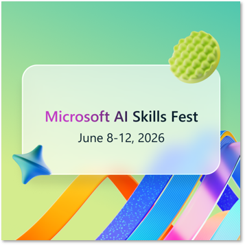
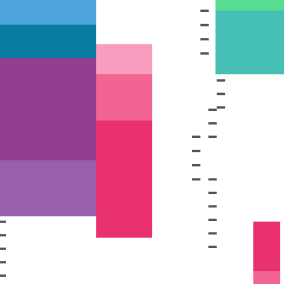
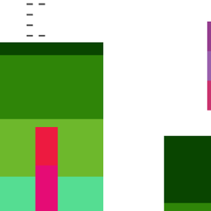

# Skills Hub: Keep up the momentum

From Build inspiration to real-world creation – your next move starts now. Whether you joined a few sessions or dove deep into a topic, keep building momentum and apply what you've learned.

<table>
<tr>
<td valign="top">
<h3>Register now for AI Skills Fest!</h3>

Join us online for a week of practical skill building at no cost and earn rewards as you complete content curated for your role. Powered by AI Skills Navigator - an agentic learning space.

<a href="https://aka.ms/AISF_BuildNextSteps">Register now</a>

</td>
<td width="200" valign="top" align="right">

</td>
</tr>
</table>

<table>
<tr>
<td width="200" valign="top" align="left">

</td>
<td valign="top">
<h3>Check out the announcements from Microsoft Build</h3>

Prove what you build at Microsoft Build—introducing Microsoft ProBadge, AI-powered learning in M365 Copilot, and new skilling paths with Anthropic and Databricks. Learn in the flow, build across stacks, and take it further at AI Skills Fest with certification opportunities and an AI hackathon.

<a href="https://aka.ms/gs_build2026">Read more</a>

</td>
</tr>
</table>

<table>
<tr>
<td valign="top">
<h3>Grow your career with Microsoft Credentials</h3>

<a href="https://aiskillsnavigator.microsoft.com/credentials?UTM_Source=BLD_Webpage&UTM_Medium=Webpage&UTM_Campaign=NextSteps">Discover credentials on AI</a> on AI Skills Navigator

<a href="https://gh.io/copilot-proficiency">Join the Insider's list</a> to get exclusive updates on the new Microsoft Pro Badge: GitHub Copilot - powered by Verified Proficiencies

</td>
<td width="200" valign="top" align="right">

</td>
</tr>
</table>

<table>
<tr>
<td width="200" valign="top" align="left">

</td>
<td valign="top">
<h3>Explore AI Skills Navigator</h3>

AI Skills Navigator is an agentic learning space, bringing together AI, cloud, and security training into one seamless, connected skilling experience to help you build career skills.

<a href="https://aiskillsnavigator.microsoft.com?UTM_Source=BLD_Webpage&UTM_Medium=Webpage&UTM_Campaign=NextSteps">Get started</a>

</td>
</tr>
</table>

### 📚 Additional Resources

- [GitHub Learn](#) — Continue your learning journey and gain real-world GitHub skills at your own pace
