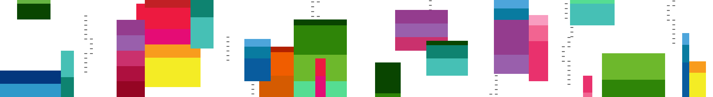

# Skills Hub: Keep up the momentum

From Build inspiration to real-world creation – your next move starts now. Whether you joined a few sessions or dove deep into a topic, keep building momentum and apply what you've learned.

## AI Skills Fest

<table>
	<tr>
		<td style="vertical-align: top; width: 56%;">
			<h3>Register now for AI Skills Fest!</h3>
			
Join us online for a week of practical skill building at no cost and earn rewards as you complete content curated for your role. Powered by AI Skills Navigator - an agentic learning space.

			
<a href="https://www.microsoft.com/en-us/ai/skills-fest">Register now</a>

		</td>
		<td style="vertical-align: top; width: 44%;">
			
		</td>
	</tr>
</table>

## Check out the announcements from Microsoft Build

<table>
	<tr>
		<td style="vertical-align: top; width: 44%;">
			
		</td>
		<td style="vertical-align: top; width: 56%;">
			<h3>Summary</h3>
			
<a href="#">View CTA</a>

		</td>
	</tr>
</table>

## Grow your career with Microsoft Credentials

<table>
	<tr>
		<td style="vertical-align: top; width: 56%;">
			<ul>
				<li><strong>Discover credentials on AI Skills Navigator:</strong> https://aiskillsnavigator.microsoft.com/credentials</li>
				<li><strong>Sign up to join the waitlist for the new credential</strong> — <a href="https://aka.ms/CredentialsBuild26">aka.ms/CredentialsBuild26</a></li>
			</ul>
		</td>
		<td style="vertical-align: top; width: 44%;">
			
		</td>
	</tr>
</table>

## Explore AI Skills Navigator

<table>
	<tr>
		<td style="vertical-align: top; width: 44%;">
			
		</td>
		<td style="vertical-align: top; width: 56%;">
			
AI Skills Navigator is an agentic learning space, bringing together AI, cloud, and security training into one seamless, connected skilling experience to help you build career skills.

			
<a href="https://aiskillsnavigator.microsoft.com">Get started</a>

		</td>
	</tr>
</table>

## 📚 Additional Resources

- [GitHub Learn](#) — Continue your learning journey and gain real-world GitHub skills at your own pace
